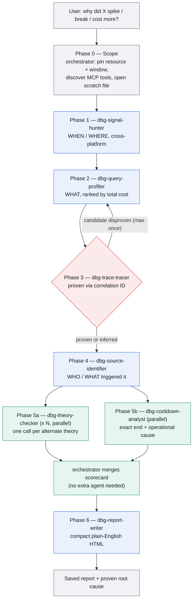

# debugcraft

Multi-agent root-cause debugging plugin for Claude Code. Project-agnostic — works against whatever observability MCP servers a project has connected (Datadog, Azure Monitor/App Insights, or others), on any codebase.

Given an incident/anomaly ("why did staging DB CPU spike yesterday", "why did checkout latency jump", "why did our cloud bill spike"), it runs a supervisor-directed, 7-agent pipeline to go from symptom to proven root cause, then writes a compact, plain-English HTML report with diagrams — the kind a non-technical stakeholder can read in under 3 minutes.

## Install (one-time, per machine)

```
/plugin marketplace add harsh-simform/debugcraft
/plugin install debugcraft@debugcraft-marketplace
```

## Use

Trigger with `/debugcraft`, or just describe the problem: "debug why X spiked", "root cause this outage", "investigate this incident".

## Pipeline

| Phase | Agent                   | Answers                                                                   | Runs                                                                        |
| ----- | ----------------------- | ------------------------------------------------------------------------- | --------------------------------------------------------------------------- |
| 1     | `dbg-signal-hunter`     | When and where did it happen, how bad?                                    | sequential                                                                  |
| 2     | `dbg-query-profiler`    | What exactly is consuming the resource?                                   | sequential                                                                  |
| 3     | `dbg-trace-tracer`      | What actually caused it — proven via correlation ID, never time-proximity | sequential, may loop back to phase 2 **once** if its candidate is disproven |
| 4     | `dbg-source-identifier` | Who or what triggered it?                                                 | sequential                                                                  |
| 5a    | `dbg-theory-checker`    | Is alternate theory N confirmed or ruled out?                             | **parallel** — one call per theory                                          |
| 5b    | `dbg-cooldown-analyst`  | Exact end of incident + operational cause?                                | **parallel**, same batch as 5a                                              |
| 6     | `dbg-report-writer`     | Compact HTML report for a stakeholder                                     | sequential, after 5a/5b collected                                           |

Full architecture, context/token rules, and phase-skip guidance: `skills/debugcraft/SKILL.md`.
Handoff envelope shape and scratch-file convention: `skills/debugcraft/references/handoff-schema.md`.
Retry ceilings, degraded/blocked semantics, loop-back and fan-out failure handling: `skills/debugcraft/references/error-handling.md`.

## Workflow



Phases 1→4 are a strict pipeline (each needs the previous phase's proven output). Phase 3 is the only loop-back point (max once, see error-handling.md). Phase 5 is the only fan-out point — every theory check and the cooldown check are independent of each other, so they dispatch together in one message with multiple parallel `Agent` calls instead of running one at a time.

## CI/CD

There is no central "publish" API for Claude Code plugins — this repo's `.claude-plugin/marketplace.json` is the distribution point itself (see [Install](#install-one-time-per-machine)). `.github/workflows/plugin-ci.yml` covers what CI actually can do:

- **On every push/PR to `main`**: `claude plugin validate` runs `--strict` against `plugin.json` and `marketplace.json`, failing the build on schema errors or warnings.
- **On push to `main`**: if `plugin.json`'s `version` isn't already tagged, it tags the release (`claude plugin tag`) and creates a GitHub Release.

To release a new version: bump `version` in `.claude-plugin/plugin.json`, merge to `main`, CI tags and releases it automatically.

## Design principles

- No assumptions — every claim traces to a tool call.
- Cross-validate across platforms when more than one can see the same fact.
- Time proximity is never treated as proof of causation — only correlation IDs, enforced by phase 3's loop-back authority.
- Self-correct out loud when a later phase disproves an earlier guess, rather than quietly patching over it.
- Ruled-out theories are reported with evidence, not silently dropped.
- Context is passed as compact structured envelopes plus a shared scratch file, not accumulated raw history — keeps the orchestrator's context flat regardless of investigation depth.
- Every tool/MCP failure gets exactly one retry, then becomes a recorded gap (`degraded`/`blocked`), never a silent fabrication or an infinite retry loop.
- The report is compact and plain-English by default — it's for someone who wasn't in the investigation.
